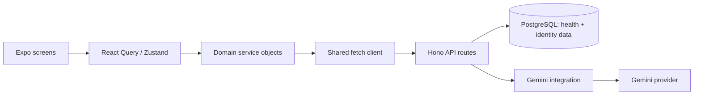
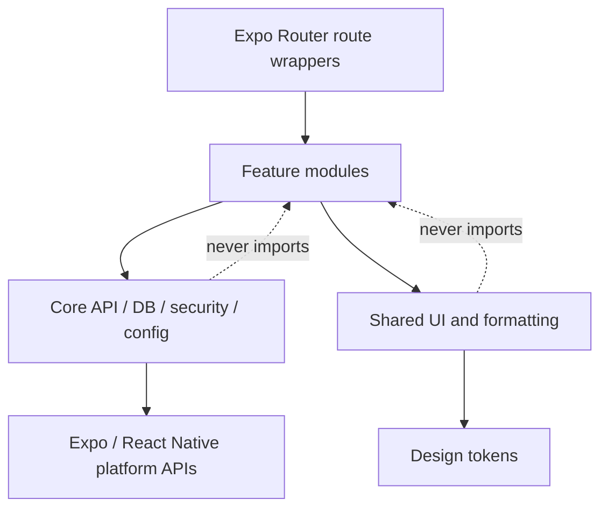

# Sehatica Mobile + Backend Architecture — Phase 1

Status: proposal updated; incremental security baseline implemented
Reviewed: 2026-08-09
Scope: `mobile-sehatica`, `web-sehatica`, and `backend-sehatica`

Implementation progress (2026-08-09):

- Completed security baseline: access/refresh token purpose separation, 15-minute access tokens, rotating refresh tokens stored as digests, refresh revocation on logout, database-backed current roles, and doctor-only review mutations.
- Replaced salted SHA-256 passwords with Bun's native Argon2id implementation.
- Updated mobile refresh handling to persist both rotated tokens and deduplicate concurrent refresh attempts.
- Completed the first local-first vertical slice for Rekam: SQLCipher structured storage and image BLOBs, a device-only SecureStore key, owner-scoped queries, and local dashboard records.
- Replaced backend record CRUD with authenticated transient `POST /ai/ocr`; OCR payloads and results are no longer persisted by that endpoint.
- Completed the local-first schedule slice: manual activity creation, offline completion/deletion, local Home projections, and atomic replacement of AI-generated items while preserving manual items.
- Replaced backend schedule CRUD with authenticated transient `POST /ai/schedules/generate`. The provider receives bounded context only, cannot persist schedules, and model-created medication items are rejected.
- Added local-first daily logging for food, medication, exercise, and water, including quantity/detail, owner scoping, offline deletion, and a quick-log flow on Home.
- Completed local-first Heally history with bounded local context from records, schedules, and daily logs; failed network replies preserve the user's question locally.
- Replaced backend Heally history/chat persistence with authenticated transient `POST /ai/chat`, bounded conversation/context payloads, deterministic safety metadata, and no automatic doctor-review persistence.
- Added account-switch cache isolation so local projections and in-memory chat from one user cannot appear for another authenticated user.
- Added a local-only PTM factor checklist on Home with a versioned deterministic instrument, owner-scoped SQLCipher results, explicit unknown-measurement follow-up, and no invented clinical score or diagnosis.
- Removed the remaining server dashboard and general-health tables/relations for records, schedules, chat, verification payloads, profile health fields, and cached daily insights. Home now reads only local health projections.
- Added opt-in local reminders for today's schedule with generic lock-screen copy and no health details in the notification payload.
- Added the first consented doctor-review slice: mobile shares one selected Heally question/answer with an available doctor, backend enforces patient ownership and doctor assignment with bounded retention, and doctor web provides an HttpOnly-cookie login, assigned queue, and approve/revise decision flow.
- Added a transaction-safe doctor provisioning CLI for fresh environments; authenticated browser QA now covers doctor login, the assigned consent bundle, a finalized web decision, and patient-side status reconciliation.
- Added eight executable mobile tests and eleven backend security/schema/parser tests. Clinical approval of the screening wording, voice/Heally-assisted logging, local daily insights, QR/volunteer relationships, subscriptions, and authenticated end-to-end fixtures still require later phases below.
- Encrypted export/import is a bonus feature and is intentionally deferred until the core patient and doctor workflows are production-ready.

The current-architecture assessment below describes the repository snapshot before these implementation changes; the target architecture and migration plan remain the source of truth.

## Executive decision

The current implementation is a server-first prototype: health records, schedules, AI chat, AI summaries, verification payloads, profile health context, and daily insights are stored in PostgreSQL. That conflicts with the requested local-first/privacy-first target.

Confirmed product constraints:

- There is no production data and no legacy health data that must be preserved.
- Mobile is the production client for regular users/patients.
- Web is the production workspace for verified doctors reviewing AI output and user-approved context.
- Health data remains local by default. Encrypted export/import for device replacement is a later bonus feature, not a core-release dependency.

The recommended target is:

1. Mobile owns health data in an encrypted SQLCipher database.
2. Backend owns identity/session data, provider credentials, abuse controls, and the doctor directory.
3. AI requests are processed transiently and are not persisted by default.
4. Doctor verification is an explicit, consented exception: persist only a user-approved review bundle, restrict it to an assigned/connected doctor, and delete its sensitive payload on a defined retention schedule.
5. Doctor web uses server-held sessions and server-side data access. The browser never stores bearer tokens or patient payloads persistently.
6. Device transfer uses an encrypted local export/import archive; it does not require health-data sync or server backup.
7. Because there is no production data, remove server health persistence before release instead of building a legacy server-to-device migration system.

Before any privacy migration, fix the current authorization, credential, transport, and medical-safety issues listed as Critical.

## A. Current architecture assessment

### Mobile

| Area | Current implementation |
| --- | --- |
| Runtime | Expo SDK 57.0.9, React Native 0.86.2, React 19.2.3, TypeScript strict |
| Routing | Expo Router file routes under `src/app`; auth group and a custom tab layout using `Slot` + `BottomTabBar` |
| State | TanStack Query for remote/server state; Zustand for auth and Heally UI/messages |
| API | A shared `fetch` wrapper plus per-domain service objects; hard-coded HTTP dev base URLs |
| Authentication | Access and refresh tokens returned by backend; both stored in SecureStore on native and `localStorage` on web |
| Local persistence | No health database. Only auth/user JSON is persisted locally |
| Health/AI data | Loaded from and written to backend APIs; Heally messages are mirrored into Zustand memory |
| UI system | Central colors, typography, spacing, radii, icon sizes, and reusable Button/TextField/Header/Chip/EmptyState/Icon components |
| Theme | App config is light-only, but components branch on system dark mode; light and dark token sets are currently identical |
| Tests | Four Playwright web UI tests; no unit, storage, auth, or contract tests |

The data path is currently:



Notable implementation details:

- Root `AuthGuard` loads stored tokens and redirects between `(auth)` and `(tabs)`.
- React Query retries all queries twice by default, including requests for sensitive dashboard data.
- The API client attempts a refresh once on `401`, but the refreshed access token is not persisted.
- `postForm` still inherits `Content-Type: application/json`, so multipart behavior is incorrect if that helper is used.
- Heally data is duplicated between React Query and Zustand. Its optimistic mutation currently destructures a string as `{ message }`, creating an optimistic message with undefined content; failed sends are not rolled back.
- Local dates use UTC `toISOString()` in multiple places, which can select the wrong calendar day in Asia/Jakarta.

### Graphify findings

Graphify was refreshed from HEAD `2d461abc` using `graphify update .`.

- 359 nodes, 662 edges, 62 communities.
- No import cycles detected.
- Highest shared hubs are theme tokens, Icon, Expo Router, and `useAuthStore`.
- File-level import analysis: `theme.ts` has 28 importers, the global `types/index.ts` barrel has 17, and `components/ui/index.ts` has 14.
- Largest screens combine rendering, mutation orchestration, data transformation, validation, and platform APIs in single 10–16 KB files.
- Weak community cohesion around the UI barrel and global types confirms unclear feature ownership, even though there are no cycles yet.

Conclusion: the codebase is small enough for an incremental feature-based split. It does not need a framework of controllers/use-cases/entities or dependency injection.

### Backend

| Area | Current implementation |
| --- | --- |
| Runtime | Bun + Hono |
| Persistence | PostgreSQL through Drizzle ORM |
| Boundaries | Route files contain validation, authorization decisions, database queries, response mapping, and AI orchestration |
| Identity | Register/login/refresh/profile; one raw refresh token stored per user |
| Health domains | Records, schedules, Heally chat, daily insight, doctors, and verification |
| AI | One Gemini module queries health tables, creates prompts, calls a hard-coded model, and regex-parses JSON |
| Validation | Manual truthy checks and `as any`; no request schema validation |
| Error format | `{ success, data }` or `{ success, error: string }` |
| Logging | Hono request logger plus `console.error`; no request ID or redaction policy |
| Deployment | Docker image runs the development hot-reload command; Compose defines only PostgreSQL |
| Database change management | `drizzle-kit push`; no migration files committed |
| Tests/quality | No backend tests, lint script, build script, or CI configuration found |

Current AI chat flow persists both sides of the conversation before/after the provider call. OCR text, summaries, schedule recommendations, health context, and daily insights are also persisted server-side.

### Doctor web

`web-sehatica` is currently an untouched Next.js 16.2 App Router template:

- one default `page.tsx`, global CSS, and generated metadata;
- no doctor authentication, authorization, dashboard, API integration, or tests;
- no domain components or state management;
- standalone production Docker build is present and runs as a non-root user;
- ESLint and TypeScript are configured, but no product code exists yet.

This means the doctor workflow can be designed cleanly around the final API contract. There is no web behavior or data migration to preserve.

## B. Problems and risks

### Critical

1. **Broken doctor authorization.** Verification approve/revise routes import `doctorMiddleware` but never apply it. Any authenticated account can currently update any verification case ID. The query also lacks doctor assignment/ownership checks.
2. **Refresh tokens are valid access tokens.** Both token types use the same verifier and the auth middleware does not require an access-token type. A refresh token with a valid `sub` can call general protected endpoints.
3. **Weak password hashing.** Passwords use one fast SHA-256 round with a salt and a non-constant-time comparison. Use a password KDF (Argon2id preferred; scrypt/bcrypt acceptable) with migration-on-login.
4. **Sensitive data is server-persisted by default.** PostgreSQL stores health conditions, allergies, records, OCR text, AI summaries, schedules, full chat, verification prompts/answers, and daily insights without a retention/deletion model.
5. **Sensitive traffic is configured over plain HTTP.** Mobile base URLs are hard-coded to `http://`; tokens, records, images, and chat can cross the network unencrypted outside a loopback-only development setup.
6. **Potential committed secrets.** Backend `.env` is tracked by Git even though `.gitignore` lists it, and it has local modifications. Treat every real credential ever placed there as exposed; remove it from tracking and rotate it without printing values.
7. **Medication safety.** AI schedule generation is asked to determine medication timing from context and the result becomes an actionable schedule. A model must never invent or alter medicine, dose, or timing. Only transform explicit user/prescriber instructions and require confirmation.

### High

- Medical-risk detection is keyword matching over generated prose and can miss unsafe advice or mark benign text. A badge does not make medical advice safe.
- Provider calls have no timeout, cancellation, bounded retry, response schema enforcement, or request/body limits.
- Gemini credentials are embedded in request URLs, which increases exposure through URL logging. Use the provider's supported secret/header mechanism.
- No rate limiting, abuse prevention, image size/type constraints, or chat/context length limits exist.
- Access tokens last seven days; refresh tokens are stored raw, are not rotated, support only one session, and have no logout/revocation endpoint.
- Doctor list responses include doctor email addresses unnecessarily.
- Web stores bearer tokens in `localStorage`, increasing impact from XSS. Production web support needs a separate cookie/BFF threat model.
- Global web CSS removes every keyboard focus indicator. This is an accessibility regression.
- CORS combines credentials with a wildcard origin policy.
- Verification allows every doctor/admin to read every submitted case; there is no assignment, purpose limitation, consent receipt, or access audit.
- Health records and images are accepted as untyped JSON/base64 and retained without explicit consent or deletion guarantees.

### Medium

- AI chat history uses ascending order plus `limit: 20`, so it selects the oldest rather than the latest messages.
- AI JSON is extracted with greedy regex and cast without schema validation.
- AI-generated schedules delete old rows and insert replacements without a transaction; partial failure can lose data.
- Verification updates and doctor counters are non-transactional and the counter update is race-prone.
- `GET /home/dashboard` performs an LLM call and database write on cache miss, making a read endpoint expensive and side-effecting.
- Dates are stored as strings and “today” is computed in UTC, not the user's timezone.
- Lists are mostly unpaginated; query limits are not bounded.
- Backend returns CSS utility class strings as schedule data, coupling API data to a UI implementation.
- The doctor screen substitutes mock doctors when the API returns an empty list, hiding an actual empty state or outage.
- Custom tab navigation uses `router.push`, which can grow navigation history unlike a real tab navigator.
- “Dark” tokens equal light tokens while components still branch on system scheme.
- Several errors are swallowed or reduced to generic alerts; there is no recoverable offline state.
- Database constraints are missing for one-doctor-per-user, user/doctor uniqueness, and one daily insight per user/date.
- Production Docker entrypoint runs the hot-reload development command.

### Low / improvement

- `homeService` lives in `verif.service.ts`; global `types/index.ts` and the UI barrel attract cross-feature imports.
- A pending verification badge is rendered twice in the chat bubble path.
- Starter/dead screens and components still reference removed theme tokens and break typecheck.
- Several installed Expo/UI/font dependencies appear unused. Verify and remove rather than adding more packages.
- Motion does not consistently honor reduced-motion preferences.

## C. Proposed mobile and doctor-web architecture

### Product domain map

| Domain | Primary client | Offline behavior | Server interaction |
| --- | --- | --- | --- |
| PTM screening/risk awareness | Mobile | Questionnaire and versioned scoring work fully offline | Optional instrument-version update; never send answers by default |
| Medical records and consultation notes | Mobile | Full local CRUD; text, image/OCR result, and voice attachment | OCR/transcription/summary only when online and explicitly requested |
| Daily health log | Mobile | Full local CRUD for food, medicine taken, exercise, water, and observations | Optional transient AI analysis |
| Scheduling/reminders | Mobile | Custom schedules, completion, and local reminders work offline | AI generation when online; doctor review by explicit share |
| Heally assistant | Mobile | Existing chat/history remains readable offline; messages can be drafted | Generation needs connectivity; minimum context is transient |
| Doctor directory/connection | Mobile + web | Cached directory may be readable; connection changes wait for network | Backend source of truth |
| AI verification | Mobile + web | Mobile keeps local case/decision; queued submission can wait for network | Explicit review bundle is temporarily persisted |
| Subscription entitlement | Mobile + backend | Last known entitlement may be cached with an expiry | Backend verifies store purchase and is authoritative |

The first PTM screening slice is now implemented locally as `ptm-factor-checklist-v1`. It reports disclosed factors and unknown measurements without assigning a percentage or clinical risk tier. Its wording and eventual escalation/retest policy still require clinician approval before production; an LLM must never invent the score.

### Mobile

Use thin Expo Router route files and feature-owned implementation:

```text
src/
  app/                         # route declarations/wrappers only
    _layout.tsx
    (auth)/
    (tabs)/
  features/
    auth/
      auth.api.ts
      auth.store.ts
      login-screen.tsx
      register-screen.tsx
    home/
      home-screen.tsx
      home.queries.ts
    screening/
      screening-screen.tsx
      screening.rules.ts       # versioned, clinician-approved deterministic rules
      screening.db.ts
    records/
      records-screen.tsx
      records.db.ts
      record-card.tsx
      record.types.ts
    heally/
      heally-screen.tsx
      heally.api.ts
      heally.db.ts
      heally.types.ts
    schedule/
      schedule-screen.tsx
      schedule.db.ts
      schedule.types.ts
    doctors/
      doctors-screen.tsx
      doctors.api.ts
      verification.api.ts
      doctor.types.ts
  core/
    api/                       # fetch, auth refresh mutex, error contract
    db/                        # SQLCipher open/migrations/transactions
    outbox/                    # explicit retry queue for user-approved network work
    security/                  # SecureStore keys, wipe, redacted logging
    transfer/                  # encrypted database export/import
    config/                    # validated environment/runtime config
  shared/
    ui/                        # tokens + truly reusable primitives
    format/                    # locale/date formatting
```

Dependency direction:



Rules:

- Route files may import one feature screen; no business logic in routes.
- A feature owns its types, database queries, server calls, hooks, and feature-specific UI.
- Cross-feature imports use a small public `index.ts` only where a real dependency exists. Avoid a global domain type barrel.
- `shared/ui` contains primitives reused by at least two features. Record, schedule, chat, and verification cards remain feature-owned.
- TanStack Query manages server state only: identity/account, doctors, verification, and AI mutations. SQLCipher is the source of truth for local health data.
- Zustand keeps session/global UI state only. Do not copy query or database collections into Zustand.
- Use an actual Expo Router Tabs navigator unless the center Heally control cannot be expressed accessibly; keep the custom visual tab bar only as `tabBar`, not as a second router.

Offline-first rules:

- Recording, daily logging, custom schedules, reminders, screening, and previously saved content must not require a network.
- OCR, transcription, Heally generation, subscription refresh, and doctor review are online enhancements. A failure never blocks saving the original local record.
- Use a small encrypted outbox with idempotency keys for explicitly submitted review/access actions. Do not silently queue raw health data before the user confirms what will be shared.
- Store source images/audio as bounded SQLCipher BLOBs for the first production version. This keeps encryption and export simple. Move to separately encrypted files only if measured database size/performance requires it.

### Doctor web

Use Next.js App Router with Server Components by default and small Client Components only for interactive forms. Follow the bundled Next.js 16 authentication/data-security guidance: authorization must occur close to each data access, not only in route guards or Proxy.

```text
src/
  app/
    (auth)/login/page.tsx
    (dashboard)/layout.tsx
    (dashboard)/reviews/page.tsx
    (dashboard)/reviews/[id]/page.tsx
    (dashboard)/connections/page.tsx
    (dashboard)/profile/page.tsx
  features/
    reviews/                   # review DTOs, decision form, timeline
    connections/               # QR/invite and access requests
    doctors/                   # doctor profile and verification status
  components/ui/              # shared web primitives/tokens
  lib/
    api/server.ts              # server-only backend client
    auth/session.ts            # server-only HttpOnly session handling
    auth/authorize.ts
    dto/                       # explicitly shaped patient-safe DTOs
```

Web security rules:

- The doctor login creates an opaque/rotating backend session stored in a `Secure`, `HttpOnly`, `SameSite` cookie. Never expose it to Client Components or `localStorage`.
- Require verified doctor status and MFA before patient data is accessible.
- The Next server is a thin BFF/UI layer; Hono remains the source of truth and repeats role, assignment, scope, and expiry checks on every request.
- Fetch review data server-side with `no-store`; send `Cache-Control: private, no-store` and never put patient payloads in static generation, CDN caches, service workers, analytics, or error replay tools.
- Pass only minimal DTO fields across the Server-to-Client boundary. Free-text patient context stays in Server Components unless a client interaction truly needs it.
- Use a strict CSP, frame protection, CSRF protection for cookie-authenticated mutations, short idle timeout, re-authentication for high-risk actions, and an access audit trail.
- Show connection, consent scope, expiry, and review purpose prominently. A doctor relationship does not automatically grant access to all health records.

### Mobile ↔ doctor relationship model

1. A connection establishes identity and permission to request access; it is not itself a blanket data grant.
2. User can connect by selecting a verified doctor (Pro path) or scanning/redeeming a short-lived signed QR invitation (volunteer/offline-consultation path).
3. QR payload contains only an opaque, expiring invitation code—never patient data, doctor secrets, bearer tokens, or a permanent grant.
4. A doctor may request a specific scope and purpose only from a connected user.
5. Mobile displays the requested fields, purpose, doctor, and expiry. User explicitly approves or rejects.
6. Each AI review creates a minimum review bundle: user question, AI answer/schedule item, and only the supporting records/context selected by the user.
7. The doctor decision returns to mobile and is saved in SQLCipher. Backend retains only the minimum receipt/counter metadata after the sensitive bundle expires.

Recommended grant scopes are narrow and composable: `ai_output:read`, `schedule:selected:read`, `records:selected:read`, and `verification:write`. Avoid an initial `all_health_data` scope.

## D. Proposed backend architecture and responsibilities

```text
src/
  index.ts
  core/
    config.ts                 # fail-fast environment validation
    db.ts
    errors.ts
    auth-middleware.ts
    request-id.ts
    redacted-logger.ts
  modules/
    auth/                     # credentials and sessions
    account/                  # account profile/deletion
    ai/                       # validation, policy, cost/rate controls
    doctors/                  # professional directory
    verifications/            # opt-in shared cases only
  integrations/
    gemini.ts                 # provider-specific DTOs remain here
```

Keep route handlers thin, but do not create controller/service/repository layers mechanically. Extract a function only when it is reused, contains non-trivial policy, or needs an isolated test.

| Responsibility | Backend? | Persistence | Recommendation |
| --- | --- | --- | --- |
| Register/login/session/account | Yes | Account and hashed/rotating sessions | Core responsibility |
| Password reset/email verification | Yes | Short-lived hashed tokens | Required before production IAM |
| LLM gateway | Yes | No prompt/response persistence | Core responsibility; transient processing only |
| Rate limiting/abuse controls | Yes | Short-lived counters/metadata | Required; prefer deployment edge/native store before a new library |
| Doctor directory | Yes | Professional/public profile data | Keep; never expose unnecessary email/private fields |
| Doctor verification | Yes | Minimal consented review bundle with TTL | Product requirement; connected/assigned-doctor access only |
| Doctor connections/access grants | Yes | Relationship, narrow scopes, purpose, expiry, revocation | Required for Pro, QR volunteer, and doctor-request flows |
| Local schedule reminders | No | Mobile-only | Use local notifications; no health text in lock-screen notification by default |
| Remote verification notifications | Yes, incrementally | Push token + generic event metadata | Poll on app open as fallback for limited connectivity; never put health text in push payloads |
| Appointments | Not yet | None | No working scheduling integration exists; add only with a provider/source of truth |
| Cross-device health sync | No for v1 | None | Conflicts with local-first; later requires client-side E2E encryption and recovery design |
| WhatsApp sync | No for v1 | None | Current UI says coming soon; it would require server persistence/consent and a new threat model |
| Subscription verification | Yes | Entitlement, provider transaction IDs, status/expiry | Required for the committed Pro doctor-selection flow; verify store events server-side |
| Consent/version tracking | Yes for shared verification/AI consent | Version, timestamp, purpose, scopes, expiry; no local record corpus | Required for doctor access and review sharing |
| Security audit events | Yes | Minimal metadata, short retention | Record login/session/verification access, never medical content |
| Feature flags/remote config | Not now | None | YAGNI until rollout needs appear |

Target backend tables are intentionally limited to `accounts`, `auth_sessions`, `doctor_profiles`, `entitlements`, `doctor_connections`, `access_requests`, `access_grants`, `review_cases`, `review_decisions`, `push_devices`, `consent_receipts`, and `audit_events`. Only `review_cases` may contain temporary health content; isolate its encrypted payload and `expires_at` from durable relationship/receipt metadata. Do not retain general records, daily logs, schedules, chat history, screening answers, or AI insights.

## E. Data classification and storage design

| Data | Sensitivity | Storage | Encryption | Backend allowed? | Notes |
| --- | --- | --- | --- | --- | --- |
| Access token | High credential | Memory only | TLS in transit | Yes, issued/validated | Short lifetime (about 10–15 minutes) |
| Refresh session token | Critical credential | SecureStore | Platform keystore/keychain | Yes, store only a hash/session record | Rotate on every refresh; revoke on logout |
| SQLCipher key | Critical secret | SecureStore | Platform keystore/keychain | No | Random per account/device; never log/export by default |
| Account name/email/phone | Personal | Backend account DB; minimal local cache | Backend disk encryption + TLS | Yes | Do not mix with medical profile |
| Conditions/allergies/blood type/DOB | Health | SQLCipher local DB | SQLCipher + device key | Transient AI only | Remove from backend user table after migration |
| Screening answers/risk result | Sensitive health | SQLCipher local DB | SQLCipher | No by default | Clinician-approved versioned algorithm; not a diagnosis |
| Medical records/OCR/transcripts | Highly sensitive health | SQLCipher local DB | SQLCipher | Transient AI only | Original picked image should be deleted from temp/cache after processing when possible |
| Source images/audio | Highly sensitive health | Bounded BLOBs in SQLCipher initially | SQLCipher | Transient OCR/transcription only | Keeps encryption/export simple; enforce size/duration limits |
| Schedules/medication reminders | Sensitive health | SQLCipher local DB | SQLCipher | Transient AI only | Notification copy should be generic by default |
| Heally chat/history | Highly sensitive health | SQLCipher local DB | SQLCipher | Transient AI only | Send the minimum conversation tail/context |
| AI summaries/insights | Sensitive derived health | SQLCipher local DB | SQLCipher | Transient AI only | Retain locally under user-controlled deletion |
| Doctor directory | Low/public professional | Backend | Standard DB controls | Yes | Exclude private contact fields |
| Review bundle | Highly sensitive, explicitly shared | Backend verification DB, temporary | TLS + encrypted database/KMS-backed field encryption | Yes, opt-in exception | Selected fields only; purpose-bound, connected/assigned access, audit, TTL |
| Doctor connection/access grant | Sensitive relationship metadata | Backend | Standard DB controls + TLS | Yes | Narrow scopes, purpose, expiry, revoke status; no automatic record access |
| Review receipt/counter | Sensitive metadata | Backend and local receipt | Standard controls; local SQLCipher | Yes | Keep case ID/status/timestamps/hash; delete free-text payload per retention |
| Subscription entitlement | Financial/account metadata | Backend; short-lived local cache | Standard controls + TLS | Yes | Store provider IDs/status, never raw payment credentials |
| Encrypted transfer archive | Highly sensitive health | User-selected file/location | SQLCipher export key derived/managed by SQLCipher | No | User-controlled; never generate a plaintext export |
| Preferences/onboarding/theme | Low | Small local settings table | Device sandbox; same encrypted DB is acceptable | No | Avoid a new key-value dependency initially |
| Raw prompt/response buffers | Highly sensitive | Memory only | Process isolation | Transient only | Clear references after completion; never log |
| Metrics/audit | Metadata | Backend observability store | TLS/disk controls | Yes | IDs/status/latency only; no prompts, record titles, filenames, or free text |

### Local database

Use Expo SDK 57 `expo-sqlite` with SQLCipher. SQLCipher is supported on Android/iOS/macOS but not Expo Go, so implementation requires a development build and `useSQLCipher` app config. Store a random database key in SecureStore; do not build custom cryptography.

Minimum tables:

- `screening_sessions` (versioned answer/result JSON for the first small instrument; normalize only if measured query needs justify it)
- `records`, `record_tags`
- `schedules`
- `chat_threads`, `chat_messages`
- `ai_insights`
- `verification_receipts` (local mapping to an explicitly shared server case)
- `settings`
- `schema_migrations`

Use local UUID/text IDs so offline writes do not require a server. Add indexes on record date/type, schedule time/date, chat thread/time, and insight expiry. Wrap multi-row changes and migrations in transactions.

Lifecycle policy:

- **Backup:** exclude the encrypted DB from automatic cloud backup in v1. A restored DB without its device key is unusable and may leak ciphertext unnecessarily.
- **Migration:** forward-only numbered SQL migrations; create an encrypted temporary copy before a destructive migration, migrate transactionally, and test upgrades from every supported schema version.
- **Logout:** recommended default is revoke server session, close DB, delete local DB and its key, clear Query cache and Zustand state. Warn before wiping. If “keep data on this device” is required, make it an explicit product decision.
- **Account deletion:** re-authenticate, delete backend account/verification cases, then wipe DB, temp files, SecureStore entries, Query cache, and in-memory state.
- **Retention:** records/chat/schedules are user-controlled locally; derived insights may expire (for example, 30 days) unless saved. Verification cases use a server TTL agreed with clinical/legal owners.
- **Device migration/recovery:** supported through explicit encrypted export/import, not background sync. Copy the SQLCipher database, re-key the copy with a user-supplied export passphrase using SQLCipher primitives, include a versioned manifest inside the encrypted database, and share the encrypted file through the platform share sheet. Import opens a temporary database, validates format/schema/account metadata and database integrity, migrates if needed, then replaces local data transactionally. Never write a plaintext JSON/CSV health export. Forgotten export passwords are not recoverable by Sehatica.
- **Biometrics:** optional app lock, not the only encryption-key recovery path. Expo documents that `requireAuthentication` data can become inaccessible after biometric enrollment changes.

## F. Proposed API contract

Keep `/api/v1` if the API has no external production consumers. If existing released clients depend on the current envelope, introduce the breaking contract under `/api/v2`.

Success:

```json
{ "success": true, "data": {} }
```

Error:

```json
{
  "success": false,
  "error": {
    "code": "VALIDATION_ERROR",
    "message": "Periksa data yang dikirim.",
    "requestId": "req_...",
    "fields": { "email": "Format email tidak valid" }
  }
}
```

Never include stack traces, provider responses, prompts, or database details. Common statuses: `400` malformed, `401` unauthenticated, `403` unauthorized, `404`, `409`, `413` too large, `422` schema/policy failure, `429`, `502` provider failure, `503` timeout/unavailable.

Mobile uses short-lived bearer access tokens plus a rotating refresh session in SecureStore. Doctor web exchanges the same backend session through a Next server action and stores the opaque session in a secure HttpOnly cookie; browser JavaScript never receives the token.

### Identity and account

| Endpoint | Purpose / auth | Request → response | Validation / statuses / rate |
| --- | --- | --- | --- |
| `POST /auth/register` | Create account; public | `{name,email,password,phone?}` → `{user,accessToken,refreshToken}` | Normalize email; strong password policy; `201/409/422/429`; about 5/hour/IP+email |
| `POST /auth/login` | Start session; public | `{email,password,deviceName?}` → tokens + minimal user | Uniform failure message; `200/401/429`; about 10/15 min/IP+account |
| `POST /auth/refresh` | Rotate session; refresh token | `{refreshToken}` → new access + refresh tokens | Require token type/session ID; reuse detection; `200/401/429` |
| `POST /auth/logout` | Revoke current session; access token | no body → `{loggedOut:true}` | Revoke hashed session; `200/401`; modest rate limit |
| `POST /auth/password/forgot` | Send reset; public | `{email}` → `202` | Same response whether account exists; strict rate limit |
| `POST /auth/password/reset` | Complete reset; public token | `{token,newPassword}` → `204` | Hashed one-time token, short TTL; revoke all sessions |
| `GET /account` | Minimal account profile; access token | none → `{id,name,email,phone,emailVerified,role}` | `200/401`; no health fields |
| `PATCH /account` | Update account profile; access token | `{name?,phone?}` → account | Field allowlist; `200/401/422` |
| `DELETE /account` | Delete account; recent auth | `{password|reauthToken}` → `202/204` | Delete sessions and owned server data; audit without payload |

Doctor accounts are never created by ordinary registration and role is never accepted from a client request. Doctor onboarding/credential verification is an admin-controlled workflow. Doctor login additionally enforces verified status and MFA.

### Entitlement

| Endpoint | Purpose / auth | Request → response | Validation / statuses |
| --- | --- | --- | --- |
| `GET /account/entitlements` | Read Pro/verification entitlement; user | none → `{plan,status,expiresAt,verificationQuota?}` | `200/401`; mobile may cache only until expiry |
| `POST /billing/verify` | Verify a mobile-store purchase; user | `{provider,purchaseToken,productId}` → entitlement | Verify server-to-server; idempotent; `200/401/409/422/429` |
| `POST /billing/webhooks/:provider` | Store lifecycle updates; signed provider call | provider event → `204` | Verify signature and replay ID; no user bearer auth |

### Stateless AI gateway

All AI endpoints require access auth, consent version, payload-size limits, timeout/cancellation, per-user/IP cost limits, provider response schema validation, and no persistence of request/response bodies.

| Endpoint | Request → response | Sensitive handling / rate |
| --- | --- | --- |
| `POST /ai/chat` | `{message,conversationTail[],healthContext?,locale,timezone}` → `{content,safety:{level,reasons[]},verificationRecommended}` | Text/context transient; cap messages and characters; low requests/minute plus daily token budget |
| `POST /ai/records/extract` | Multipart `{file}` → `{extractedText,title,summary,tags[],documentType}` | MIME sniffing, image/PDF allowlist, byte/pixel/page limits; delete buffers after response; lower rate |
| `POST /ai/records/summarize` | `{content,recordType,locale}` → `{summary,tags[]}` | Transient text; structured output; strict character limit |
| `POST /ai/schedules/generate` | `{date,timezone,constraints,explicitMedicationInstructions[]}` → `{items[],warnings[]}` | Must not invent medicines/dose/timing; schema and policy validation; user confirms before local save |
| `POST /ai/insights/generate` | `{date,timezone,healthContext}` → `{mainInsight,tips[],expiresAt}` | Transient context; no server cache containing health data |

Streaming is not required for the first migration. Add SSE only if measured chat latency/UX warrants the extra cancellation/reconnect complexity.

### Doctors, connections, access, and verification

| Endpoint | Purpose / auth | Request → response | Sensitive handling / statuses |
| --- | --- | --- | --- |
| `GET /doctors` | Directory; authenticated | `?specialty&available&cursor` → public doctor page | No email/private contact; `200/401` |
| `GET /doctors/:id` | Public professional profile; authenticated | none → doctor profile | `200/401/404` |
| `POST /doctor-invitations` | Create short-lived QR invitation; verified doctor | `{purpose?,expiresIn}` → `{code,expiresAt,qrPayload}` | Opaque signed/random code; rate limited; no patient data |
| `POST /doctor-connections` | Pro user selects doctor | `{doctorId}` → connection | Require active entitlement and doctor availability; `201/403/409` |
| `POST /doctor-connections/redeem` | User redeems QR invitation | `{code}` → connection | Single/limited use, expiry and doctor verification checks |
| `GET /doctor-connections` | User or doctor lists own connections | cursor → scoped connection summaries | Side-specific DTOs; never enumerate unrelated users |
| `DELETE /doctor-connections/:id` | Revoke relationship; either party | none → `204` | Revoke active grants and block new reviews; define handling of in-progress cases |
| `POST /doctor-connections/:id/access-requests` | Connected doctor requests data scope | `{scopes[],purpose,expiresAt}` → request | Scope allowlist, reason required, bounded expiry; `201/403/409/422` |
| `GET /access-requests` | Mobile lists user's pending requests | cursor → requests | `200/401`; supports polling when push is unavailable |
| `PATCH /access-requests/:id` | User approves/rejects | `{decision,approvedScopes?,expiresAt?}` → grant/request | Owner-only, cannot broaden requested scope; `200/403/409/422` |
| `DELETE /access-grants/:id` | User revokes access | none → `204` | Immediate revocation; existing sensitive fetches become unauthorized |
| `POST /reviews` | Explicitly share one AI output/schedule; user | `{connectionId,kind,question?,aiOutput,selectedContext[],consentVersion,idempotencyKey}` → `{id,status,expiresAt}` | Require connection + grant/Pro policy; minimum bundle; `201/403/413/422/429` |
| `GET /reviews` | User's own case status | cursor → receipt/status summaries | No cross-user data; mobile merges decision into local SQLCipher data |
| `DELETE /reviews/:id` | Withdraw pending case; owner | none → `204` | Ownership/state check; delete sensitive bundle when allowed |
| `GET /doctor/reviews` | Doctor review queue | `?status&cursor` → assigned/eligible cases | Doctor role, verified status, relationship/assignment and expiry checks |
| `GET /doctor/reviews/:id` | Open one review bundle | none → minimal review DTO | Audited access; `Cache-Control: private, no-store`; `403` after revoke/expiry |
| `PATCH /doctor/reviews/:id/decision` | Submit doctor decision | `{version,decision:"approved"|"revised"|"rejected",note?,correctedOutput?}` → receipt | Assignment, optimistic version, transaction; `200/403/409/422` |

The doctor completion counter increments only after a valid finalized decision, in the same transaction. Protect it against duplicate submissions and administrative reversals. Treat it as reputation metadata—not proof of review quality.

Retire after local migration: server CRUD for `/records`, `/schedules`, `/heally/messages`, and health-data aggregation in `/home/dashboard`.

## G. LLM data flow

```mermaid
sequenceDiagram
  participant M as Mobile UI
  participant DB as Local SQLCipher
  participant B as Backend AI gateway
  participant P as LLM provider

  M->>DB: Read minimum local context (persisted locally)
  M->>B: TLS request with selected context (transient)
  B->>B: Auth, validate, rate-limit, redact telemetry
  B->>P: Provider request (transient at Sehatica)
  P-->>B: Provider response
  B->>B: Validate structured output and safety policy
  B-->>M: Normalized response (not persisted by backend)
  M->>DB: User confirms/save; encrypt locally
```

Sensitive data exists in mobile memory, encrypted local storage, backend memory during the request, and the provider's processing boundary. It must not enter application logs, traces, analytics, crash breadcrumbs, URLs, caches, or temporary files. Provider retention/training terms and data region remain an explicit vendor/legal decision.

Doctor verification is a separate opt-in branch: the mobile displays exactly what will be shared, records consent, submits only that case, and shows its expiry/deletion policy.

```mermaid
sequenceDiagram
  participant U as User mobile
  participant L as Local SQLCipher
  participant B as Backend
  participant W as Doctor web

  U->>L: Select AI output + supporting context
  U->>U: Preview scope, doctor, purpose, expiry
  U->>B: Submit consented review bundle
  B-->>W: Queue only for eligible connected/assigned doctor
  W->>B: Server-side fetch with doctor session
  B->>B: Authorize role + assignment + grant + expiry; audit
  B-->>W: Minimal no-store review DTO
  W->>B: Decision/revision
  B-->>U: Generic notification or status on next poll
  U->>B: Fetch receipt/decision
  U->>L: Persist decision locally
  B->>B: Delete sensitive bundle at retention deadline
```

For limited-connectivity/3T usage, local features remain complete. AI and doctor flows expose explicit `waiting_for_network`, `submitted`, `reviewing`, `completed`, `expired`, and `failed_retryable` states. Push is an optimization; polling on app open and manual refresh are required fallbacks.

## H. Design system proposal

### Reference and direction

HaloAI was inspected with agent-browser, including a rendered full-page screenshot and computed styles. Its reference language is a white editorial canvas, near-black text, restrained green/teal accents, Fraunces-style serif display typography, Geist-style sans UI text, thin borders, small radii, generous whitespace, and quiet pastel feature panels.

Sehatica should translate that into **clinical calm with an editorial voice**, not copy the website. Reuse the already-installed Playfair Display and DM Sans instead of adding Fraunces/Geist.

The first concept (a grid of pastel cards) was too generic. The revised signature is a **care trail**: one thin, accessible state line that connects record → AI analysis → optional doctor verification. It visually represents continuity of care and appears only in timelines/status-heavy views. Other surfaces stay quiet.

### Tokens

| Role | Token | Proposed value |
| --- | --- | --- |
| Brand/action | `brand.700` | `#087A57` (deep teal, white-text capable) |
| Brand hover/pressed | `brand.800` | `#066247` |
| Brand soft | `brand.050` | `#ECFDF5` |
| Text primary | `ink.950` | `#18181B` |
| Text secondary | `ink.650` | `#52525B` |
| Text muted | `ink.500` | `#71717A` |
| Canvas | `surface.canvas` | `#FFFFFF` |
| Subtle surface | `surface.subtle` | `#F7F7F5` |
| Border | `border.default` | `#E4E4E7` |
| Informational soft | `info.050` | `#EFF8FF` |
| Verification soft | `violet.050` | `#F3F0FF` |
| Warning | `warning.700/050` | `#A15C00` / `#FFF7E6` |
| Danger | `danger.700/050` | `#B42318` / `#FEF3F2` |

- Display: Playfair Display 500/600, used sparingly for the greeting/insight thesis and empty-state headlines.
- Body/UI: DM Sans 400/500/700.
- Type scale: 12, 14, 16, 20, 24, 32 with dynamic font scaling; do not truncate critical health content.
- Spacing: retain the existing 4/8/12/16/20/24/32/48 scale.
- Radius: 8 controls, 12 cards, 16 sheets; pills only for tags/status.
- Elevation: prefer 1 px borders; use one low shadow only for floating/sheet surfaces.
- Icons: retain the existing Ionicons wrapper and 16/20/24 tokens.

### Reusable strategy

Keep and evolve `Button`, `TextField`, `ScreenHeader`, `Chip`, `EmptyState`, and `Icon`. Add variants/states only when used. Keep RecordCard, ScheduleItem, ChatBubble, VerificationStatus, and CareTrail inside their features.

Use the same color/type/token vocabulary on doctor web, but optimize its layout for clinical review rather than copying the mobile cards: a dense queue, a wide evidence/AI comparison pane, an always-visible consent/scope header, and a clear decision composer. The care trail becomes the shared signature across mobile and web, connecting generated → shared → opened → reviewed → returned states.

Accessibility requirements:

- Restore visible keyboard focus on web; never globally suppress it.
- Minimum 44×44 touch targets and semantic/accessibility labels.
- WCAG AA contrast; do not use HaloAI's bright teal directly behind white text.
- Status uses icon + text, never color alone.
- Honor reduced motion; the Heally pulse should stop when reduced motion is enabled.
- Product currently supports light mode only. Do not advertise dark mode until a separate, contrast-tested dark palette exists.

## I. Incremental migration plan

1. **Emergency hardening:** protect doctor decisions, enforce token types, replace password KDF, rotate/remove tracked secrets, require TLS outside dev, cap requests, disable AI-created medication instructions.
2. **Freeze contracts and policies:** doctor connection/grant/review states, retention, provider terms, screening instrument ownership, Pro entitlement, and account/logout behavior. Create shared request/response fixtures.
3. **Remove prototype server persistence before release:** delete records, schedules, chat messages, daily insights, and health fields from backend schema/routes. No legacy export endpoint or dual-write is needed because production data does not exist.
4. **Local storage foundation:** add SQLCipher development-build config, SecureStore key lifecycle, migrations, BLOB limits, wipe flow, and storage tests.
5. **Move mobile domains incrementally:** screening → records/daily log → schedules/reminders → Heally chat/insights. The home screen reads local projections. Every core feature works without a backend.
6. **Stateless AI gateway:** switch OCR/transcription/summary/chat/schedule/insight to transient contracts, add schema/safety validation, and ensure the provider integration cannot query health tables.
7. **Identity and entitlement:** hardened sessions for mobile and web, verified doctor onboarding/MFA, App Store/Play entitlement verification, account deletion, and generic notification registration.
8. **Connection and review exception:** QR invite, Pro assignment, doctor request, explicit mobile consent, minimum review bundle, access audit, decision receipt, and TTL deletion.
9. **Doctor web:** build authenticated queue and detail/decision flows with server-only data access, no-store behavior, CSP/CSRF protections, and authorization tests.
10. **UI alignment:** apply revised tokens and typography to shared mobile/web primitives, then migrate screens feature by feature with screenshot and accessibility checks.
11. **Deployment hardening:** migrations, production start/build commands, health/readiness checks, secret manager, redacted observability, CI gates, and backup/restore/runbook verification.
12. **Bonus device transfer:** add encrypted export/import only after the core patient and doctor workflows are stable.

Each step should be independently reviewable. Because no production data exists, perform the destructive schema cleanup before public release rather than carrying a temporary compatibility layer.

## J. Testing and verification strategy

| Layer | Required checks |
| --- | --- |
| Unit | Date/timezone helpers, validation, token classification, safety policy, local projections |
| Local DB/transfer | Fresh schema, every migration path, encrypted reopen, BLOB limits, wrong-key failure, transaction rollback, logout/account wipe, export/import round trip, wrong password, corrupt archive, newer/older schema |
| API integration | Register/login/refresh rotation/logout, authorization matrix, payload limits, rate limits, redacted errors |
| Contract | Shared JSON fixtures/schemas consumed by mobile and backend; provider DTOs excluded |
| AI gateway | Mock provider: timeout, cancellation, invalid JSON, unsafe medication output, retryable/non-retryable errors; assert no persistence/logging |
| Verification | User isolation, doctor role/MFA/verified state, QR expiry/replay, connection revocation, grant scopes, assignment, consent, concurrent decision conflict, TTL deletion, audit metadata, idempotent counter |
| Mobile component | Loading/empty/error/offline states, dynamic text, screen-reader labels, reduced motion, focus visibility |
| Mobile E2E | Auth fixture, screening, records/daily-log local CRUD, offline restart, queued online work, local reminders, AI mock flow, logout wipe, export/import, opt-in verification |
| Doctor web E2E | Doctor login/MFA fixture, queue filtering, no unauthorized case access, grant expiry/revoke while open, decision conflict, logout/cache clearing, accessibility |
| Static/build | Mobile, web, and backend typecheck/lint; Expo development build; Android/iOS smoke build; Next production build; production backend/web images |
| Security | Secret scan, dependency audit, log-capture tests with canary sensitive strings, backup/restore test, TLS-only production config |

Current verification baseline:

- Graphify refreshed successfully; no import cycles.
- Mobile TypeScript check passes with zero errors; all eight mobile tests pass; Expo web and Android exports pass.
- Expo SQLite WASM resolution is configured in Metro; the mobile web export no longer fails on `wa-sqlite.wasm`.
- Backend TypeScript check passes with dependency declaration checks skipped; all eleven backend tests pass.
- Mobile and doctor-web ESLint checks pass.
- Existing Playwright artifacts show all four tests failing because the suite opens the login page without authenticating; several asserted labels are also stale.
- Doctor web now has the production login, assigned review queue, minimum consent bundle, and approve/revise flow. Its TypeScript check, ESLint check, production build, valid/invalid-login browser flows, authenticated decision flow, and WCAG A/AA axe audit pass.
- Contract tests, authenticated E2E coverage, release-device SQLCipher/notification smoke tests, and CI are still missing.

## K. Open questions

Resolved by product clarification:

- No production/legacy data needs preservation; remove server health persistence before release.
- Mobile and doctor web are both production targets.
- Doctor verification, QR connections, volunteer requests, and Pro doctor selection are product requirements.
- Device replacement uses user-controlled encrypted export/import; health sync is not required.

Remaining decisions:

1. **Which clinician-approved PTM screening instruments and target populations are in scope?** Scoring rules, contraindications, disclaimer, retest interval, and escalation thresholds must be clinically owned and versioned.
2. **What exactly can each doctor relationship type request?** Define scope and expiry defaults separately for Pro-assigned doctors, QR-connected doctors from offline consultation, and volunteers.
3. **What is the sensitive review-bundle retention period?** Recommended technical default is short (for example pending expiry plus 30 days after decision), but clinical/legal dispute requirements may mandate a different duration.
4. **How are doctors credentialed, suspended, and assigned?** Define license verification, MFA, availability, specialty matching, volunteer eligibility, reassignment, and administrator responsibilities.
5. **Who owns the medical-safety policy?** A clinician/product owner must define prohibited outputs, emergency escalation, medication constraints, schedule confirmation, and what “verified” legally means.
6. **Which subscription providers/products and verification quota rules apply?** This determines App Store/Play integration, server notifications, grace periods, refunds, and doctor compensation/assignment.
7. **Which provider terms, retention mode, and data region are approved for health payloads?** Backend non-persistence does not eliminate provider processing or provider-side retention risk.
8. **Where will backend and doctor web be deployed?** Region, secret manager/KMS, edge rate limiting, database encryption, email/push delivery, CSP, and observability depend on hosting.
9. **What attachment limits are acceptable?** Expected image count/resolution and voice duration determine whether SQLCipher BLOB storage remains sufficient or a separately encrypted file store is needed.
10. **What should logout mean on a shared device?** Recommended default is local wipe after an explicit warning; encrypted export is the recovery path. Confirm whether “logout but retain encrypted local data” is required.

## Sources consulted

- Existing source in `mobile-sehatica`, `web-sehatica`, and `backend-sehatica`
- Refreshed `graphify-out/GRAPH_REPORT.md` and `graphify-out/graph.json`
- HaloAI visual reference: <https://www.haloai.co.id/>
- Expo SDK 57 documentation: <https://docs.expo.dev/versions/v57.0.0/>
- Expo SDK 57 SecureStore persistence/backup: <https://docs.expo.dev/versions/v57.0.0/sdk/securestore/>
- Expo SDK 57 SQLCipher support: <https://docs.expo.dev/versions/v57.0.0/sdk/sqlite/#sqlcipher>
- Expo SDK 57 SQLite web/WASM setup: <https://docs.expo.dev/versions/v57.0.0/sdk/sqlite/#web-setup>
- Expo SDK 57 local notifications: <https://docs.expo.dev/versions/v57.0.0/sdk/notifications/>
- WHO noncommunicable disease risk-factor overview: <https://www.who.int/en/news-room/fact-sheets/detail/noncommunicable-diseases>
- Kementerian Kesehatan Posbindu PTM risk-factor monitoring: <https://www.kemkes.go.id/id/masalah-hipertensi-di-indonesia>
- Kementerian Kesehatan PTM overview and screening measurements: <https://keslan.kemkes.go.id/view_artikel/2501/mengenal-penyakit-tidak-menular>
- Bundled Next.js 16 guides for authentication, data security, Server/Client Components, and Content Security Policy in `web-sehatica/node_modules/next/dist/docs/`
